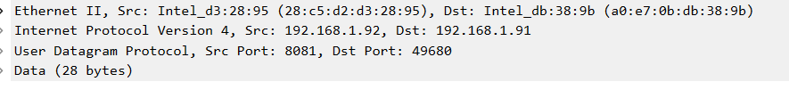
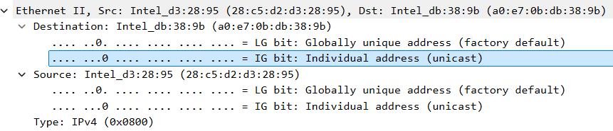
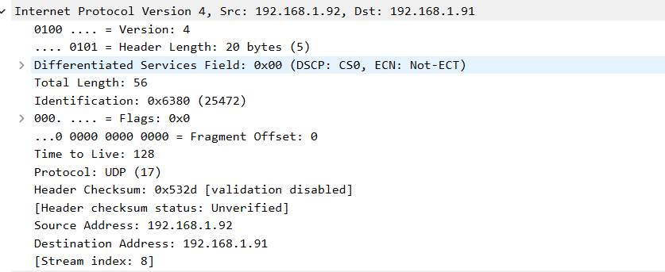

#Explanation of Message Flow



This is a capture of UDP message flow on the client end.  

!UDP Header

As shown, the packet includes UDP headers along with lower-layer protocol headers. 




The Ethernet header, part of Layer 2 (Data Link Layer), contains the source and destination MAC addresses, which identify devices on the local network.


 The IPv4 header, belonging to Layer 3 (Network Layer), is responsible for routing the packet across different networks. 
 
 
 Finally, the UDP header, located at Layer 4 (Transport Layer), facilitates connectionless communication between applications.

## 📡 Message Flow Breakdown

### **UDP Message Flow**

#### **1. Client Initiation**
```python
# Client creates UDP socket (no connection needed)
client_socket = socket.socket(socket.AF_INET, socket.SOCK_DGRAM)
server_address = (server_host, server_port)
```
The client creates a UDP socket without establishing a connection since UDP is connectionless.

#### **2. Packet Transmission**
```python
# Send data
print(f"Sending message: '{message}'")
client_socket.sendto(message.encode('utf-8'), server_address)
```
The client encodes the message and sends it directly to the server's address using `sendto()` without prior connection.

#### **3. Server Reception**
```python
# Server receives data with sender address
data, addr = udp_socket.recvfrom(1024)
print(f"UDP received from {addr}: {data.decode('utf-8')}")
```
The server receives the packet and automatically gets both the message data and the sender's address information.

#### **4. Server Response**
```python
# Server sends echo response back to sender
udp_socket.sendto(f"Echo: {data.decode('utf-8')}".encode('utf-8'), addr)
```
The server creates an echo response and sends it back to the original sender's address using the captured `addr`.

#### **5. Client Reception**
```python
# Receive response
response, server = client_socket.recvfrom(1024)
print(f"UDP Server response: {response.decode('utf-8')}")
```
The client receives the server's response packet along with the server's address and displays the echoed message.

### **TCP Message Flow**

#### **1. Client Initiation**
```python
# Client creates socket and connects
client_socket = socket.socket(socket.AF_INET, socket.SOCK_STREAM)
print(f"Connecting to TCP server at {server_host}:{server_port}")
client_socket.connect((server_host, server_port))
```
The client creates a TCP socket and establishes a connection to the server using the IP address and port.

#### **2. Packet Transmission**
```python
# Send data
print(f"Sending message: '{message}'")
client_socket.send(message.encode('utf-8'))
```
The client encodes the string message into bytes and transmits it over the network to the server.

#### **3. Server Reception**
```python
# Server receives data
data = client_socket.recv(1024).decode('utf-8')
print(f"TCP received: {data}")
```
The server receives the incoming packet, decodes the bytes back to a string, and processes the message.

#### **4. Server Response**
```python
# Server sends echo response
client_socket.send(f"Echo: {data}".encode('utf-8'))
```
The server creates a response by prepending "Echo: " to the received message and sends it back to the client.

#### **5. Client Reception**
```python
# Receive response
response = client_socket.recv(1024)
print(f"TCP Server response: {response.decode('utf-8')}")
```
The client receives the server's response packet, decodes it, and displays the echoed message to complete the communication cycle.


